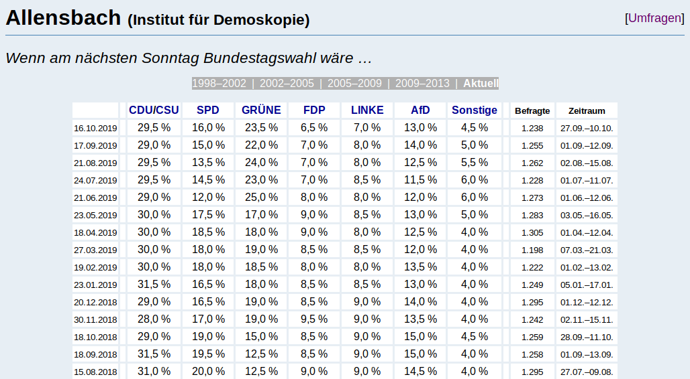

# Hausaufgaben
ifp R Bootcamp: Modul 3

## Übung: Wahlumfragen

Unser Ziel: Wir wollen die Ergebnisse von allen Sonntagsfragen vergleichen können – für alle Parteien, alle Umfrageinstitute und alle Umfragetermine. Dafür gibt es die Seite [wahlrecht.de](http://www.wahlrecht.de/umfragen/index.htm), die seit 20 Jahren Umfrageergebnisse sammelt.

### Teil 1: Umfragen scrapen

*Aufgabe:* Gehe das Skript `wahlrecht_uebungen.R` durch und vervollständige die Lücken.

#### Vorgehen

1. Auf der Seite [wahlrecht.de/umfragen](http://www.wahlrecht.de/umfragen/index.htm) scrapen wir die Links zu den Unterseiten der Umfrageinsitute.

2. Dort scrapen wir die Links zu den vorherigen Zeiträumen (z.B. [wahlrecht.de/umfragen/allensbach/2002.htm](http://www.wahlrecht.de/umfragen/allensbach/2002.htm))

3. Durch diese Linkliste gehen wir systematisch durch und scrapen die Tabellen mit den Umfrageergebnissen, die darauf eingetragen sind
4. Zuletzt säubern wir die gesammelten Daten, um sie in einen nutzbaren Datensatz zu verwandeln.

[Wahlergebnisse](https://www.bundeswahlleiter.de/europawahlen/2019/ergebnisse.html) | [Strukturdaten](https://www.bundeswahlleiter.de/europawahlen/2019/strukturdaten.html), abgerufen am: 10.06.2019

### Teil 2: Analysefragen überlegen

*Aufgabe:* Überlege dir drei Fragestellungen, die man mit diesem Datensatz beantworten könnte, und finde die Antworten mithilfe deiner R-Fähigkeiten.

### Teil 3 [OPTIONAL]: Datenprojekte nachbauen

*Aufgabe:* Wer nach Tei 1 und 2 der Hausaufgabe noch nicht genug hat, kann sich der Übung widmen, zu der wir im Kurs nicht mehr gekommen sind: Die Datenjournalismus-Projekte anderer Teams verstehen und nachbauen!

- sucht euch eins der drei Projekte aus
- guckt euch Artikel und Methodik an
- versucht, das Skript in RStudio nachzuvollziehen
- Überlegt:
	- Welche Analysepunkte würden euch noch interessieren?
	- Wie könntet ihr aus dieser Analyse ein neues Projekt drehen? (zeitlich, räumlich, thematisch?)
	- BONUS: Probiert neue Fragestellungen selbst in R aus

*Datenprojekte-Auswahl:*

1. SZ: [Das gespaltene Parlament](http://sz.de/afdimbundestag)
	- *Daten & Code zum Artikel:* [github.com/sueddeutsche/afd-im-bundestag](https://github.com/sueddeutsche/afd-im-bundestag)
	- *Team Github Repo:* [github.com/sueddeutsche](https://github.com/sueddeutsche)
2. DW Data: [Die Vorlieben der Oscar-Academy](https://www.dw.com/a-47499539) | [Was Hollywood-Filme über Vorurteile offenbaren](https://www.dw.com/a-47561600)
	- *Daten & Code zum Artikel:* [github.com/dw-data/movie-tropes](https://github.com/dw-data/movie-tropes)
	- *Team Github Repo:* [github.com/dw-data](https://github.com/dw-data)
3. BR Data: [Das verbaute Land](http://web.br.de/interaktiv/flaechenverbrauch/)
	- *Daten & Code zum Artikel:* [github.com/br-data/2018-flaechenverbrauch-analyse](https://github.com/br-data/2018-flaechenverbrauch-analyse)
	- *Team Github Repo:* [github.com/br-data](https://github.com/br-data)

