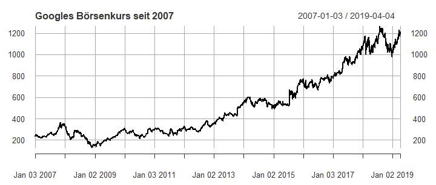

3 - R Basics
========================================================
author: Benedict Witzenberger
date: 16.04.2019
autosize: true

RStudio
========================================================


> RStudio ist eine vom Unternehmen RStudio, Inc. angebotene, integrierte Entwicklungsumgebung und grafische Benutzeroberfläche für die statistische Programmiersprache R. 

> (Wikipedia)

Vorteile:

* vier Bildschirmbereiche, die individuell angeordnet und eingerichtet werden können

* Ansicht von Datensätzen möglich

* nur teilweise Ausführung des Codes möglich

* eigener Anschluss an die Git-Verwaltung, eigene Konsole

* integrierte Hilfe und Debugger

* Zusatzfeatures: R Markdown, R Presentations, Shiny-Apps

RStudio
========================================================

Ausgewählte Shortcuts: 

* Hilfe zu ausgewählter Funktion: F1, oder ?[Funktion]

* Neues Skript: Strg + Shift + N / Cmd + Shift + N

* Speichern: Strg/Cmd + S

* Auswahl ausführen: STRG/CMD + Enter

* Alles ausführen: Strg + Shift + Enter / Cmd + Shift + Enter

* Mehrzeiliger Kommentar: Strg + Shift + C / Cmd + Shift + C

Verfügbar in RStudio unter `Tools -> Keyboard Shortcuts Help` und als [Cheatsheet](https://github.com/rstudio/cheatsheets/raw/master/rstudio-ide.pdf)

R-Studio: Über was wir geredet haben sollten
========================================================

* Verschieden Bereiche: Konsole, Skript, Terminal, Workspace, Plots, Packages, Environment, History

* `getwd()` und `setwd()`

* Session: Restart, Quit

* View: Zoom alles oder einzelne Bereiche (z.B. `Strg/Cmd + Shift + 2`), Focus (z.B. `Strg/Cmd + 1`)

* Kommentare mit `#`

* Projekte und einzelne Skripte


Die R-Konsole: Grundrechenarten
========================================================

`42 + 30`

```
> 42 + 30
[1] 72
```

`60/10`

`3*4`

`10-9.5`

Versucht es selbst!

Darstellung von Code
========================================================
In dieser Präsentation wird Code unterschiedlich dargestellt:

Als Kombi aus Konsoleneingabe und -ausgabe:

```
> 42 + 30
[1] 72
```

äquivalent zu:


```r
42 + 30
```

```
[1] 72
```


Die R-Konsole: Mathematische Funktionen
========================================================

abs()

min()

max()

log(x, base = y)

exp(x)

sqrt(x)

factorial(x) = x!

Die R-Konsole: Statistik-Funktionen
========================================================

mean(x)

median(x)

var(x)

sd(x)

quantile(x)

range()

IQR()

summary(x) 

Funktion in R
========================================================

Wir könnten natürlich schreiben:

`1 + 2 + 3 + 4 + 5 + 6 + 7 + 8 + 9 + 10`

Aber deswegen lernen wir ja nicht Programmieren! 

Wir nutzen Funktionen:

`function(arg1 = xyz, arg2 = xyz, ...)`


```r
sum(c(1:10))
```

```
[1] 55
```

Befehle eingeben
========================================================

`max(1,2,3)`

In Konsole und `ENTER` oder ins Skript und `Strg/Cmd + ENTER`

Ausgabe:


```r
max(1,2,3)
```

```
[1] 3
```

Befehle eingeben: Debugging (Fehler ausbessern)
========================================================

```
> sum(1, 0, "error")
Error in sum(1, 0, "error") : invalid 'type' (character) of argument
```

In der Konsole [Pfeil hoch]: letzter Befehl wird angezeigt

Dann mit [Pfeil links] oder [Pfeil rechts] den Befehl bearbeiten

Weiterer Fall: Die Klammer der Funktion wurde nicht geschlossen:

```
> max(1,2,
+ 5)
[1] 5
```

Hilfe zu Funktionen bekommen
========================================================

`help(Funktionsname)` oder `?Funktionsname` zeigen die Hilfeseite der Funktion an.

-> Geht schneller über [F1]

`args(Funktionsname)` zeigt die Argumente der Funktion an, allerdings ohne Erklärung 

`example(Funktionsname)` zeigt ein vordefiniertes Beispiel zur Funktion an

```
help(sum)
```

**Kurze Übung:**

Findet die Hilfe zu `mean`, `median` und `max` auf verschiedenen Wegen und versucht den Grundaufbau der Hilfeseiten zu verstehen.

Kleiner Recap: Statistik I
========================================================

Der Durchschnitt: `mean()` der `median()`

`1 2 3 4 5 6 7 8 9 10`


```r
mean(1:10)
```

```
[1] 5.5
```

```r
median(1:10)
```

```
[1] 5.5
```


Kleiner Recap: Statistik II
========================================================

Aber: Vorsicht bei großen Werten


```r
mean(c(10, 20, 50, 70, 90, 1500))
```

```
[1] 290
```

```r
median(c(10, 20, 50, 70, 90, 1500))
```

```
[1] 60
```

```r
quantile(c(10, 20, 50, 70, 90, 1500))
```

```
    0%    25%    50%    75%   100% 
  10.0   27.5   60.0   85.0 1500.0 
```

`summary()` deckt Teile der Berechnungen für einen ganzen Dataframe ab.

Variablen in R
========================================================

`<- = =`

`x <- 10` (`<-` besteht aus `<` (kleiner als) und einem Bindestrich `-`)

`x <- "Benedict"`

`rm(variable)` (oder: Alle Variablen löschen mit `rm(list=ls())`)

Warum `<-` ?
========================================================

Trennung zwischen Variablenzuweisung und Funktionsargumenten (stammt aus Vorgängersprache APL, da wurde `=` nur für Vergleiche verwendet: `1 = 1`)

`x <- 10` oder `mean(x = 10)`

```
> median(x = 1:10)
> x
Error: object 'x' not found
```
Im Gegensatz zu:


```r
median(x <- 1:10)
```

```
[1] 5.5
```

```r
x
```

```
 [1]  1  2  3  4  5  6  7  8  9 10
```

Aber: <- = = ?
========================================================

Inzwischen lassen sich in R Variablen auch mit `=` definieren. 

Allerdings macht das den Code unübersichtlicher und gilt als schlechter Stil.

Deswegen:

`<-`  weißt Variablen einen Wert zu

`=`  weißt Argumente in Funktionen zu

`==`  nutzen wir für Vergleiche (kommt noch)

(und bitte nie `->` benutzen! Das geht auch, schafft aber nur Chaos im Code)

Variable anzeigen
========================================================


```r
x <- 42
```

Variable definiert, aber es passiert nicht mehr. Wollen wir ja auch nicht.

Jetzt wollen wir sie anzeigen. Dafür gibt es zwei Varianten, die gleich funktionieren:


```r
x
```

```
[1] 42
```

```r
print(x)
```

```
[1] 42
```

Warum steht vor der 42 eine [1]?

Datentypen in R
========================================================

* Vektoren

* Matrix

* Dataframe

* Liste

* Array

| Dimension        | Homogen           | Heterogen  |
| ------------- | ------------- | ----- |
| 1      | **Vektor** | Liste |
| 2      | Matrix      |   Dataframe |
| 3      | Array      |   - |

Zahlen und Texte
========================================================

R kennt vier unterschiedliche Basisinhalte, sortiert nach ihrer aufsteigenden Komplexität:

* logical: `TRUE / FALSE` oder `T / F`, Boolean

* integer: `1L, 6L, 10L`, Ganzzahl

* double (in R oft `numeric`genannt): `1, 5.4367, 209.5`, Dezimalzahlen

* character: `"Benedict", "ifp", "a"`

Übung: Datentypen
========================================================

Schreibt euch kurz für euch auf, welche der Datentypen diese Beispiel sind:

`x1 <- 1L`

`x2 <- "109.2"`

`x3 <- F`

`x4 <- pi`

Lösung: Datentypen
========================================================

Schreibt euch kurz für euch auf, welche der Datentypen diese Beispiel sind:

`x1 <- 1L` Integer

`x2 <- "109.2"` Character

`x3 <- F` Logical

`x4 <- pi` double (numeric)

Hilfreiche Funktion: `class(x)`


```r
class(pi)
```

```
[1] "numeric"
```

Der (atomic) Vektor
========================================================

Klassischer und beliebtester Datentyp in R


```r
c(1,2,3)
```

```
[1] 1 2 3
```

```r
c("a", "b", "c")
```

```
[1] "a" "b" "c"
```

Ein Vektor kann nur einheitliche Werte enthalten. Also nur Characters oder nur Integers.

Aber was passiert hier?


```r
c(1, "b", TRUE)
```

```
[1] "1"    "b"    "TRUE"
```

Was passiert hier?
========================================================

Aber was passiert hier?


```r
x <- c(1, "b", TRUE)
```


```r
str(x)
```

```
 chr [1:3] "1" "b" "TRUE"
```


Typische Eigenschaften von Vektoren
========================================================

* Type, `typeof()`: Welche Daten er enthält
* Length, `length()`: Wie viele Elemente er hat
* Attributes, `attributes()`: Zusätzliche Infos

typeof()
========================================================


```r
int_var <- c(1L, 6L, 10L)
typeof(int_var)
```

```
[1] "integer"
```

```r
is.integer(int_var)
```

```
[1] TRUE
```

```r
is.numeric(int_var) # wird bei Nummern immer TRUE
```

```
[1] TRUE
```

```r
is.double(int_var)
```

```
[1] FALSE
```

length()
========================================================


```r
dbl <- 2.5
dbl_var <- c(1.0, 209, 15000)

length(dbl)
```

```
[1] 1
```

```r
length(dbl_var)
```

```
[1] 3
```

Vektoren zusammenführen ("Coercion")
========================================================

Vektoren mit verschiedenen Datentypen werden beim Zusammenführen in den komplexesten Datentyp umgewandelt:

Logical -> Integer -> Double -> Character

Passiert automatisch:

```r
sum(TRUE, FALSE, TRUE)
```

```
[1] 2
```

Um den Überblick zu bewahren, sollte man es explizit angeben:

```
as.character()
as.numeric() / as.double()
as.integer()
as.logical()
```

Aufgabe: Vektoren
========================================================

Erstellt zwei Vektoren: der erste enthält nur double-Werte, der zweite darf aus allen Typen gemischt werden.

Versucht, auf beide Vektoren `sum(x)` anzuwenden. Was passiert?

Versucht dann, beide Vektoren zusammenzuführen (mit `c()`). Welchen Typ hat der Vektor danach?

Listen
========================================================

| Dimension        | Homogen           | Heterogen  |
| ------------- | ------------- | ----- |
| 1      | Vektor | **Liste** |
| 2      | Matrix      |   Dataframe |
| 3      | Array      |   - |

Listen
========================================================

Listen sind eine Form des Vektors, deswegen werden die Vektoren offiziell "Atomic Vector" genannt.


```r
x <- list(1:3, "a", c(TRUE, FALSE, TRUE), c(2.3, 5.9))
str(x)
```

```
List of 4
 $ : int [1:3] 1 2 3
 $ : chr "a"
 $ : logi [1:3] TRUE FALSE TRUE
 $ : num [1:2] 2.3 5.9
```

Listen können verschiedene Datentypen enthalten, werden aber auch schnell sehr komplex (vgl. JSON):


```r
x <- list(list(list(list())))
str(x)
```

```
List of 1
 $ :List of 1
  ..$ :List of 1
  .. ..$ : list()
```

Liste zu Vektor
========================================================

`unlist(x)` wandelt eine Liste in einen Vektor um. Dabei gelten diesselben Regeln, wie bei der Umwandlung eines Verktors mit verschiedenen Datentypen.

**Interessant:**

Alle komplexeren Datentypen in R sind eigentlich Listen: zum Beispiel Dataframes und Modelle

Attribute von Objekten
========================================================

Alle Objekte in R können Attribute haben, zum Beispiel für Metadaten. DIese Attribute werden als Liste bei dem Objekt gespeichert:


```r
y <- 1:10
attr(y, "mein_attribute") <- "Das ist ein Vektor"
attr(y, "mein_attribute")
```

```
[1] "Das ist ein Vektor"
```

Bei der Umwandlung gehen die meisten Attribute verloren. Nur drei bleiben immer:

* Namen

* Dimensionen

* Klasse

Namen I
========================================================

Es gibt drei Varianten, einem Vektor Namen zu geben:

* Beim Erstellen: `x <- c(a = 1, b = 2, c = 3)`

* Beim Verändern eines bestehenden Vektors: 
```
x <- 1:3
names(x) <- c("a", "b", "c")
```

* Beim Kopieren in eine modifizierte Variante: `x <- setNames(1:3, c("a", "b", "c"))`.

**Schnelle Übung:**

1. Erstellt einen beliebigen Vektor mit Namen (Variante 1 oben)

2. Benennt ihn um

Namen II
========================================================

Nicht alle Elemente müssen einen Namen haben:


```r
y <- c(a = 1, 2, 3)
names(y)
```

```
[1] "a" ""  "" 
```

```r
names(y) <- c('a')
names(y)
```

```
[1] "a" NA  NA 
```

Namen können gelöscht werden mit `unname(x)` oder `names(x) <- NULL`

Factors I
========================================================

Factors sind eine Variante der Vektoren in R. Sie speichern kategoriale Daten:

* endliche Kategorien, keine natürliche Wertung

* Beispiele: Geschlecht, Zahlungsmethoden, Schulabschluss


```r
x <- factor(c("a", "b", "b", "a"))
x
```

```
[1] a b b a
Levels: a b
```

Factors haben `levels(x)`. Sie können keine Daten annehmen, die nicht in den Levels definiert sind:

```
> x[2] <- "c"
Warning message:
In `[<-.factor`(`*tmp*`, 2, value = "c") :
  invalid factor level, NA generated
```

Factors II
========================================================

Wir definieren einen Character-Vektor und einen Factor mit den gleichen Daten:


```r
geschl_char <- c("m", "m", "m", "m", "m")
geschl_factor <- factor(geschl_char, levels = c("m", "f"))
```


```r
table(geschl_char)
```

```
geschl_char
m 
5 
```

```r
table(geschl_factor)
```

```
geschl_factor
m f 
5 0 
```

Bei Factors gehen Informationen über Beobachtungen mit n=0 nicht verloren

Kleine Übung:
========================================================

Was passiert, wenn die Levels eines Factors verändert werden?

```
f1 <- factor(letters)

levels(f1) <- rev(levels(f1))

f2 <- rev(factor(letters))

f3 <- factor(letters, levels = rev(letters))
```

Lösung:
========================================================

`f1 <- factor(letters)`Erstellt einen Factor mit dem Inhalt und Levels a, b, c, ...

`levels(f1) <- rev(levels(f1))` Dreht Levels und damit den ganzen Factor um

`f2 <- rev(factor(letters))` Erstellt einen neuen Factor (wie f1), die Levels bleiben korrekt

`f3 <- factor(letters, levels = rev(letters))` Hier werden Factor und Levels beim erstellen verdreht.

Matrizen und Arrays
========================================================

| Dimension        | Homogen           | Heterogen  |
| ------------- | ------------- | ----- |
| 1      | Vektor | Liste |
| 2      | **Matrix**      |   Dataframe |
| 3      | **Array**      |   - |

Matrizen und Arrays
========================================================

Matrizen und Arrays sind Vektoren, die in Dimensionen eingeteilt wurden. Sie haben nur einen Datentyp.

Das geht sehr einfach, sogar mit einem bestehenden Vektor:


```r
c <- 1:6
dim(c) <- c(3, 2)
c
```

```
     [,1] [,2]
[1,]    1    4
[2,]    2    5
[3,]    3    6
```

Sonst funktioniert die Erstellung so:


```r
a <- matrix(1:6, ncol = 3, nrow = 2)

b <- array(1:12, c(2, 3, 2))
```


Matrizen und Arrays II
========================================================

Funktionen wir `length()` können wir hier nutzen, sie sind aber schwer zu verstehen. Besser:

`nrow()`und `ncol()` oder `dim()


Bei Namen ist es ähnlich:

`colnames()` und `rownames()` oder `dimnames()`


```r
rownames(a) <- c("A", "B")
colnames(a) <- c("a", "b", "c")
a
```

```
  a b c
A 1 3 5
B 2 4 6
```

Matrizen und Arrays III: Wichtige Funktionen
========================================================

`c()` wird zu `cbind()` und `rbind()`

Mit `t()` kann eine Matrix transponiert werden.

Matrizen und Vektoren verhalten sich teilweise anders - können aber gleich aussehen: Deswegen `str()` nutzen


```r
str(1:3)
```

```
 int [1:3] 1 2 3
```

```r
str(matrix(1:3, ncol = 1))
```

```
 int [1:3, 1] 1 2 3
```

Der Dataframe (oder data frame)
========================================================

| Dimension        | Homogen           | Heterogen  |
| ------------- | ------------- | ----- |
| 1      | Vektor | Liste |
| 2      | Matrix      |   **Dataframe** |
| 3      | Array      |   - |

Der Dataframe (oder data frame)
========================================================

Der meistgenutze Weg, um Daten in R zu speichern. Er fühlt sich an, wie ein Spreadsheet oder Excel-Dokument - dafür mögen wir ihn.

Faktisch ist ein Dataframe eine Kombination aus verschiedenen Vektoren mit gleicher Länge. Deswegen hat er Eigenschaften von Vektoren und Matrizen:

* `names()` (das gleiche wie `colnames()` beim Dataframe)

* `rownames()`

* `length()` (das gleiche wie `ncol()`)

* `nrow()`

Je nachdem, wie wir einen Dataframe zuschneiden, kann er sich wie eine Matrix oder eine Liste verhalten.

Wir können Vektoren, Listen oder Matrizen zu einem Dataframe konvertieren (mit unterschiedlichen Anforderungen)

Dataframe erstellen
========================================================


```r
df <- data.frame(x = 1:3, y = c("a", "b", "c"))
str(df)
```

```
'data.frame':	3 obs. of  2 variables:
 $ x: int  1 2 3
 $ y: Factor w/ 3 levels "a","b","c": 1 2 3
```

Besser: 

```r
df <- data.frame(x = 1:4, y = c("a", "b", "c", "d"), stringsAsFactors = FALSE)
str(df)
```

```
'data.frame':	4 obs. of  2 variables:
 $ x: int  1 2 3 4
 $ y: chr  "a" "b" "c" "d"
```


```r
typeof(df)
```

```
[1] "list"
```

Dataframes kombinieren
========================================================


```r
cbind(df, data.frame(z = rep(c(TRUE, FALSE), 2)))
```

```
  x y     z
1 1 a  TRUE
2 2 b FALSE
3 3 c  TRUE
4 4 d FALSE
```


```r
rbind(df, data.frame(x = 10, y = "z"))
```

```
   x y
1  1 a
2  2 b
3  3 c
4  4 d
5 10 z
```

**Frage:** Warum zeigt mir `rbind()` die Spalte mit TRUE und FALSE nicht an?

Exkurs: Es gibt Tools, die Vektoren unterschiedlicher Länge in Dataframes "binden". Zum Beispiel dplyrs `bind_rows()`. Ihr lernt dazu mehr im zweiten Blockkurs.

Fragen zum Dataframe
========================================================

1. Welche Attribute hat ein Dataframe?

2. Was passiert wohl, wenn ich einen Dataframe mit numeric und characters zu einer Matrix umwandeln will?


Schnelles Beispiel:
========================================================


```r
#install.packages(c("quantmod", "dygraphs"))

library(quantmod)
library(dygraphs)

google_stocks <- getSymbols("GOOG", src = "yahoo", from = "2007-01-01", auto.assign = FALSE)

plot(google_stocks[,"GOOG.Close"], main = "Googles Börsenkurs seit 2007", type = "l")
```



