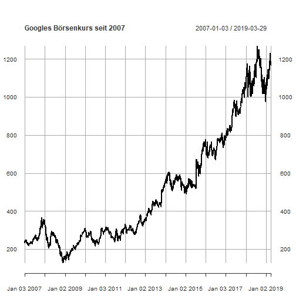

3 - R Basics
========================================================
author: Benedict Witzenberger
date: 16.04.2019
autosize: true

RStudio
========================================================


> RStudio ist eine vom Unternehmen RStudio, Inc. angebotene, integrierte Entwicklungsumgebung und grafische Benutzeroberfläche für die statistische Programmiersprache R. 

> (Wikipedia)

Vorteile:

* vier Bildschirmbereiche, die individuell angeordnet und eingerichtet werden können

* Ansicht von Datensätzen möglich

* nur teilweise Ausführung des Codes möglich

* eigener Anschluss an die Git-Verwaltung, eigene Konsole

* integrierte Hilfe und Debugger

* Zusatzfeatures: R Markdown, R Presentations, Shiny-Apps

RStudio
========================================================

Ausgewählte Shortcuts: 

* Hilfe zu ausgewählter Funktion: F1, oder ?[Funktion]

* Neues Skript: Strg + Shift + N / Cmd + Shift + N

* Speichern: Strg/Cmd + S

* Auswahl ausführen: STRG/CMD + Enter

* Alles ausführen: Strg + Shift + Enter / Cmd + Shift + Enter

* Mehrzeiliger Kommentar: Strg + Shift + C / Cmd + Shift + C

Verfügbar in RStudio unter `Tools -> Keyboard Shortcuts Help` und als [Cheatsheet](https://github.com/rstudio/cheatsheets/raw/master/rstudio-ide.pdf)

Die R-Konsole: Grundrechenarten
========================================================

`42 + 30`

```
> 42 + 30
[1] 72
```

`60/10`

`3*4`

`10-9.5`

Die R-Konsole: Mathematische Funktionen
========================================================

abs()

min()

max()

log(x, base = y)

exp(x)

sqrt(x)

factorial(x) = x!

Die R-Konsole: Statistik-Funktionen
========================================================

mean(x)
median(x)
var(x)
sd(x)
quantile(x)
range()
IQR()
summary(x) 

Kleiner Recap: Statistik
========================================================

Variablen in R
========================================================

<- = =

rm(variable)

Datentypen in R
========================================================

* Character

* Numeric

* Vektoren

* Dataframe

* Liste


Schnelles Beispiel:
========================================================


```r
#install.packages(c("quantmod", "dygraphs"))

library(quantmod)
library(dygraphs)

google_stocks <- getSymbols("GOOG", src = "yahoo", from = "2007-01-01", auto.assign = FALSE)

plot(google_stocks[,"GOOG.Close"], main = "Googles Börsenkurs seit 2007", type = "l")
```



