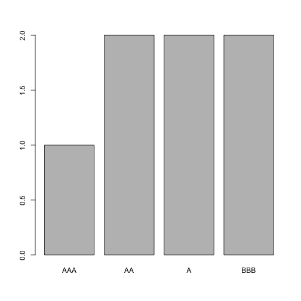

Nachtrag zu Dienstag
========================================================
author: Benedict Witzenberger
date: 17. April 2019
autosize: true

Order in Factors
========================================================

Es gibt Factors, die eine Reihenfolge haben: Ordered factors.

Beispiel von Datacamp, warum man die Reihenfolge in Factors ändern möchte:


```r
credit_rating <- c("AAA", "AA", "A", "BBB", "AA", "BBB", "A")

credit_factor_ordered <- factor(credit_rating, ordered = TRUE, 
                                levels = c("AAA", "AA", "A", "BBB"))

plot(credit_factor_ordered)
```




Reihenfolge in Vektoren ändern
========================================================


```r
x <- c(1, 2, 3)
x
```

```
[1] 1 2 3
```

```r
x[c(2,3,1)]
```

```
[1] 2 3 1
```
